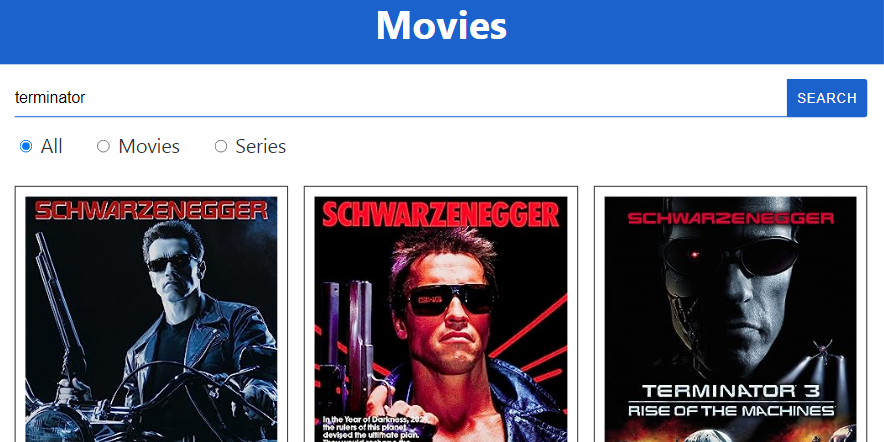

# <a name='nav'>Movies</a>

Это учебное приложение, написанное с использованием React. Вы можете посмотреть демо-версию приложения на [GitHub Pages по этой ссылке](https://voverg.github.io/react-movies 'Посмотреть демо-версию')

- [Описание](#description)

---

## <a name='description'>Описание</a>
Приложение "Фильмы":
- Приложение использует открытое API [omdbapi](https://www.omdbapi.com/) с информацией о фильмах, которое позволяет осуществлять поиск только на английском языке
- Чтобы найти фильмы, в поле поиска можно вбить название фильма и нажать кнопку "search" (или Enter на клавиатуре)
- Можно делать поиск только по фильмам, только по сериалам или по всему сразу (для этого выбираем соответствующую опцию под строкой поиска)
- 

[Назад к заглавию](#nav)
